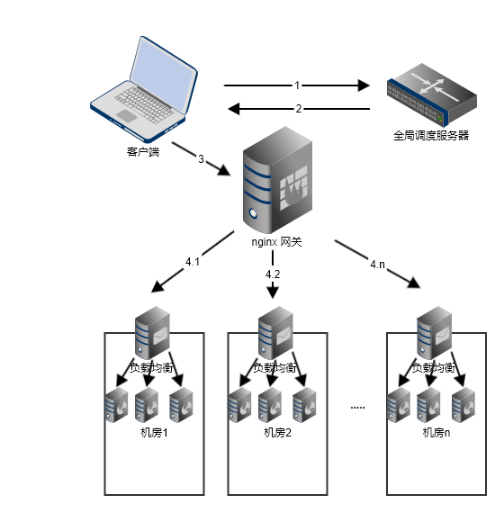

# resty-gate

openresty 网关项目，支持通过 consul 做服务发现，支持使用 http 1.1 模式反向代理到后端 http 服务，支持设置 http 1.1 的连接池数目，支持分布式多机房架构。

## 初衷

resty-gate 的设计目的是为了解决分布式集群的访问问题。大型系统为了防止中心化机房导致的单点问题，一般会在多个地区部署多个机房，以防止单个机房物理故障导致的服务不可用。一般我们能想到的一个拓扑图，应该是这个样子的：



1. 客户端根据实物 ID 请求全局调度服务器
2. 全局调度服务器返回当前实物 ID 对应的域名
3. 客户端根据返回的域名拼接一个 URL ，访问 nginx 网关
4. nginx 网关根据域名反向代理到具体的机房

考虑到 `nginx 网关`不可能关心机房内部的服务节点 IP 列表，所以一般在机房中还在放置一个`负载均衡服务器`，流量先打到`负载均衡服务器`上，然后再做转发。讲述到这里，这个设计的缺点已经很明显了，`负载均衡服务器` 成为了每个机房中心节点，单个服务的高流量会拉升整个 `负载均衡服务器`  的系统资源，也就是说不同应用之间是相互干扰的。可能你们会问，最上层的 `nginx 网关` 流量是最终的，会面临同样的问题，但是 `nginx 网关` 属于边缘节点，会在全国各地部署若干入口点，从数量上讲是可观的，一般来说算力都是很富余的。

我们还需要考虑到的一个问题就是，机房增删怎么办。删除好说，配置文件不做修改也无伤大雅；但是增加机房的话，就必须得修改 `nginx 网关` 的配置文件。从操作上来增加了维护成本。

由于上述的原因，第一版的设计肯定不是最优的，所以我们需要对其进行改进。考虑到 `nginx 网关` 和机房之间是有专线的，所以我们可以从这上面做文章。


我们这里讲服务直接注册到 consul 集群中，然后由 nginx 网关来进行发现，这样 nginx 网关可以获知当前访问服务的所有节点，根据策略来直接将流量访问具体的某个机房中的某个节点上。

1. 客户端根据实物 ID 请求全局调度服务器
2. 全局调度服务器返回机房 ID
3. 客户端拼接 URL 格式为 `https://gateway_domian/机房ID/服务名称/服务内部访问路径`
4. `nginx 网关`根据服务发现得到的服务列表直接请求到具体节点

## 配置

修改 docker/usr/local/openresty/nginx/conf/service/proxy.conf 

```nginx
server {
  listen 80;
  server_name your_gate_domain1 your_gate_domain2;
  include conf/commons/*.conf;

  location / {
    access_by_lua_file conf/lua/access.lua;
    content_by_lua_file conf/lua/content.lua;
  }

}
```

可以将 server_name 改为你网关服务映射的域名。

本项目支持通过环境变量  `CONSUL_ADDR` 来做 consul 初始化连接，如果此变量不存在，则默认为 `127.0.0.1:8500`。如果使用默认值，则需要修改 docker/etc/consul.d/client.json，修改其中的 `retry_join` 属性为你的 consul 集群的地址列表；如果使用环境变量传递一个非默认值，以当前镜像启动的容器会重命名 docker/etc/supervisor.d/consul.ini 文件。

上述配置更改完成后，最后修改 build.sh，将其中的 `TAG_LATEST` 改成你自己的镜像仓库的镜像地址，然后执行 ./build.sh 来打镜像。

## 测试

使用命令

```shell
curl  --resolve ${your_gate_domain}:80:${gate_ip} http://${your_gate_domain}/${cluster_id}/${service_name}/${service_path}
```

可以将请求发送到 resty-gate 所在机器上，这里假定 resty-gate 的暴漏端口是 80 。`${cluster_id}` 是指 consul 的 datacenter 名称，`${service_name}` 是指注册到 consul 上的应用名称，`/${service_path}` 是应用内部的访问路径。


## 待做

- [ ] 构建时支持自定义域名
- [ ] 支持自定义服务过滤标签

